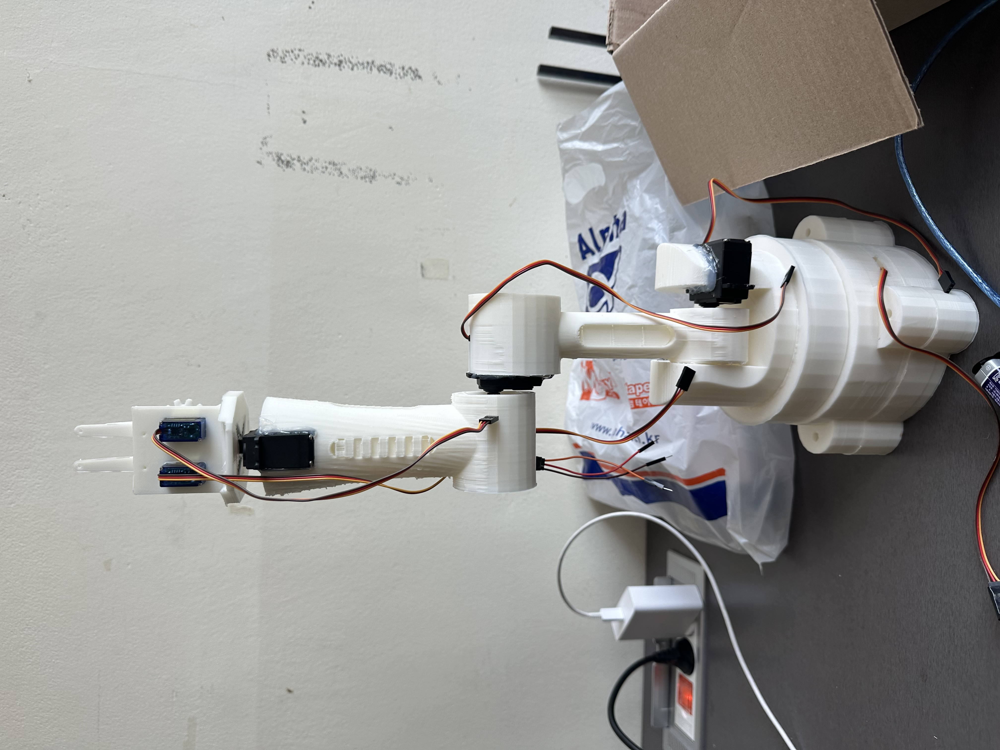
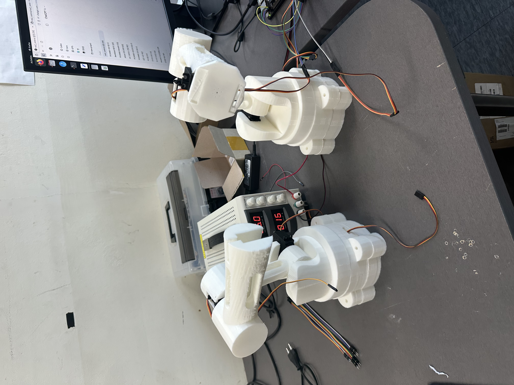

# 🤖 4-DOF Robot Arm (SolidWorks + 3D Printing)

SolidWorks-based 4-DOF robot arm design with STL/G-code and 3D printing results

## 📌 Overview / 개요
- This project is a **4-DOF robot arm** designed in SolidWorks  
  and fabricated using **PLA material** with a 3D printer.
  
- 본 프로젝트는 SolidWorks로 설계한 **4자유도 로봇팔**을  
  **PLA 소재**로 3D 프린팅하여 제작한 결과물입니다.  

---
## 🛠 Features
- 5 DOF design
- Low-cost servo motor compatibility (MG996R, MG90S)
- 3D-printable parts (PLA filament, FDM printing)
- Lightweight & modular design for easy prototyping

---
Compatible with ROS2 motion planning
## 📂 Files / 파일 구성
- `Solidworks Files/` : SolidWorks design files (.SLDPRT, .SLDASM) / 설계 파일  
- `3D Printing Parts/` : STL and G-code files for 3D printing / 출력용 STL, G-code  
- `Result/` : Printed results (JPG) / 출력 결과 사진
  

## 📊 Results (결과)
- 
- 

---
